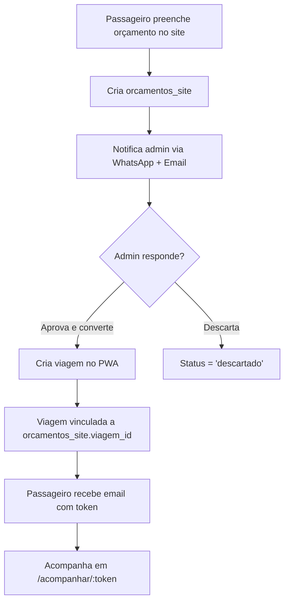
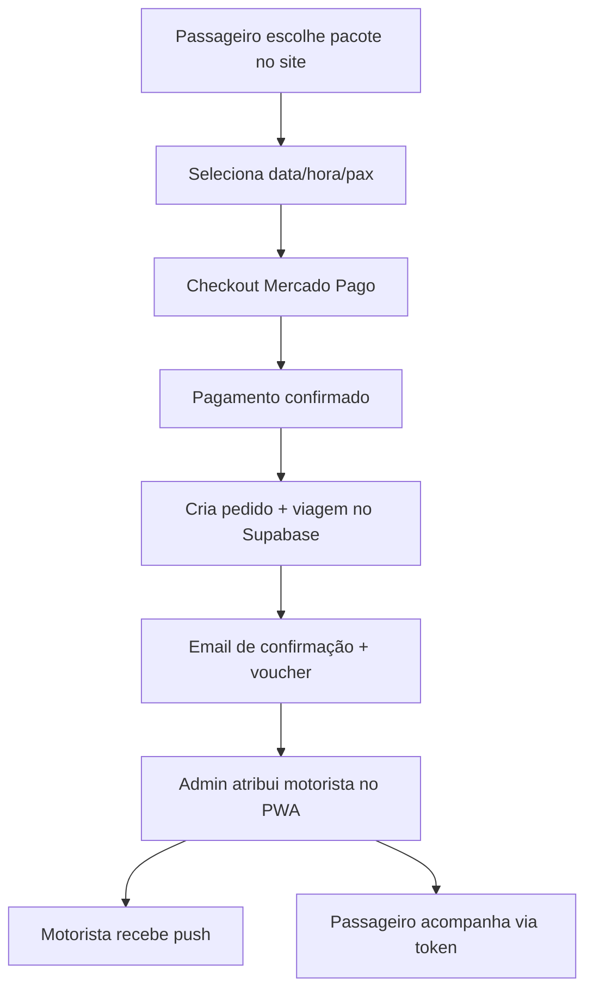
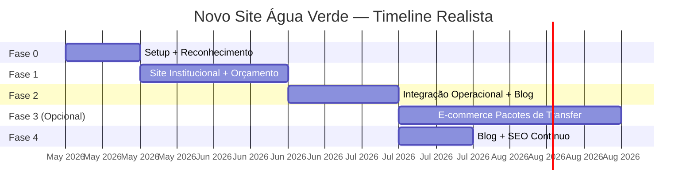

# Novo Site aguaverde.tur.br — Redesign + E-commerce Opcional (v4)

> **v4**: Plano corrigido após análise profunda do banco de dados real, do PWA (`agua-verde-app`), do app nativo (`agua-verde-transfers`) e da automação de reservas por e-mail (n8n).
>
> **Mudança estratégica**: O site não nasce como e-commerce. Nasce como **institucional + captação de leads** (orçamento). O e-commerce de "pacotes de transfer" (rotas fixas) é uma **fase opcional futura**, ativada apenas quando houver tráfego e demanda comprovada.

---

## 1. Contexto & Análise do Estado Atual

### O Ecossistema Real da Água Verde

A Água Verde é uma agência de turismo receptivo em Recife/PE. O negócio opera com **três frentes digitais** e uma automação robusta:

```
┌────────────────────────────────────────────────────────────────────┐
│                    FORNECEDORES EXTERNOS (OTAs)                     │
│   iNeedTours • FoxTransfer EU/BR • AirportTransfer.com • etc.      │
│                         ↓ e-mail diretoria@                        │
└────────────────────────────────────────────────────────────────────┘
                              │
                              ▼
┌────────────────────────────────────────────────────────────────────┐
│                    AUTOMACAO n8n (Backoffice)                       │
│  - Leitura IMAP conta "DIRETORIA"                                   │
│  - Classificação por remetente + extração Claude (Anthropic)        │
│  - Cria/atualiza viagem direto no Supabase                          │
│  - 4.888 viagens no banco; ~99,9% vêm deste canal                  │
└────────────────────────────────────────────────────────────────────┘
                              │
                              ▼
┌────────────────────────────────────────────────────────────────────┐
│                         SUPABASE (banco único)                      │
│  ┌──────────────┐  ┌──────────────┐  ┌──────────────────────────┐  │
│  │   viagens    │  │  motoristas  │  │  app.aguaverde.tur.br    │  │
│  │  (4.888)     │  │    (89)      │  │  PWA Backoffice          │  │
│  └──────────────┘  └──────────────┘  │  (admin/gerente)         │  │
│  ┌──────────────┐  ┌──────────────┐  └──────────────────────────┘  │
│  │   perfis     │  │  fornecedores│  ┌──────────────────────────┐  │
│  │   (93)       │  │    (19)      │  │  agua-verde-transfers    │  │
│  └──────────────┘  └──────────────┘  │  App Nativo (motoristas) │  │
│                                      └──────────────────────────┘  │
└────────────────────────────────────────────────────────────────────┘
                              │
                              ▼
┌────────────────────────────────────────────────────────────────────┐
│              SITE STARTER (aguaverde.tur.br) — ATUAL                │
│  - Vitrine básica na plataforma Starter                             │
│  - Hero slider genérico, cards de serviço simples                   │
│  - Widget de reserva lateral com calendário                         │
│  - Consulta de voucher por CPF/Email (sem login)                    │
│  - ~0 reservas diretas comprovadas no banco (apenas 4 e-mails,      │
│    todos de fornecedores externos)                                  │
└────────────────────────────────────────────────────────────────────┘
```

### Dados Relevantes do Banco

| Métrica | Valor | Implicação |
|:--------|:------|:-----------|
| Total de viagens | 4.888 | Volume operacional saudável |
| Viagens com e-mail do passageiro | 4 (0,08%) | Site atual não captura e-mails |
| Viagens via site Starter | ~0 | Canal digital direto é inexistente |
| Status mais comum | `concluida` (2.934) | Operação madura |
| Passageiros recorrentes | Vários com 7-10 viagens | Base fiel, mas sem identidade digital |
| `token_cliente` | 100% das viagens | Sistema token-based funciona bem |
| `avaliacoes` (tabela) | 0 registros | Tabela existe mas está vazia; avaliações estão em `viagens.avaliacao_nota` |
| `perfis.tipo` | `admin`, `gerente`, `motorista`, `guia`, `estagiario` | NÃO inclui `passageiro`; constraint rígida |

### PWA Existente (`app.aguaverde.tur.br`)

O PWA já resolve muito do que o plano anterior propunha:

- ✅ **Página pública de acompanhamento**: `/acompanhar/:token` — mapa em tempo real, status, avaliação
- ✅ **Chat WhatsApp interno** com IA auto-resposta
- ✅ **Gestão completa** de viagens, motoristas, faturas, pagamentos
- ✅ **Console GPS** histórico com replay
- ✅ **Notificações push** para admin/gerente
- ✅ **Faturas** para fornecedores (iNeedTours, FoxTransfer)

### App Nativo (`agua-verde-transfers`)

- App exclusivo para **motoristas** (React Native + Expo 54)
- Usa `perfis.tipo = 'motorista'` para roteamento
- Qualquer alteração em `perfis` ou na navegação pode quebrar o app

### O que o Site Novo REALMENTE Precisa

Com base nos dados, o objetivo do novo site é:

1. **Substituir o Starter** com um visual premium moderno
2. **Captar leads** via SEO + formulário de orçamento
3. **Converter visitantes** via WhatsApp (canal preferido no Brasil)
4. **Oferecer acompanhamento** da viagem (já existe no PWA, pode ser reutilizado ou migrado)
5. **Preparar terreno** para e-commerce futuro (pacotes de transfer com rotas fixas)

---

## 2. Decisões Consolidadas ✅

| Questão | Decisão | Justificativa |
|:--------|:--------|:--------------|
| **Escopo inicial** | **Site institucional + orçamento** | E-commerce direto não tem demanda comprovada (~0 vendas pelo site) |
| **E-commerce** | **Fase 3 opcional** — pacotes de transfer (rotas fixas) | Quando houver tráfego SEO + demanda comprovada |
| **Migração Starter** | **100% sunset** | Redirects 301 obrigatórios |
| **Domínio** | Substituir `aguaverde.tur.br` direto | Staging em subdomínio antes da troca |
| **Backend** | Supabase existente | Reutiliza `viagens`, `fornecedores`, `motoristas`, etc. |
| **Auth passageiro** | **Token-based (legado) + opcional Supabase Auth** | Não obrigar login; manter `/acompanhar/:token` |
| **Tabela `perfis`** | **NÃO ALTERAR** | App nativo depende da constraint atual; criar entidade separada se necessário |
| **Hospedagem** | Vercel | Consistente com PWA existente |
| **Pagamento futuro** | Mercado Pago | Zero mensalidade, ~4,99%/tx, Pix nativo |
| **Multi-idioma** | PT/EN/ES (next-intl) | Público internacional (dados do banco confirmam) |
| **Fotos** | Acervo próprio + geração AI | Complementar acervo existente |
| **Mapas** | Mapbox GL | Consistente com PWA e app nativo |

---

## 3. Arquitetura & Stack

### Stack

| Componente | Tecnologia | Justificativa |
|:-----------|:-----------|:--------------|
| **Framework** | Next.js 15 (App Router) | SSR para SEO, ISR para páginas dinâmicas |
| **Styling** | Tailwind CSS 4 + shadcn/ui | Produtividade; shadcn copia código para o repo |
| **Backend** | Supabase (mesmo projeto) | Reutiliza 100% da infra existente |
| **Auth** | Supabase Auth (opcional) | Para e-commerce futuro; site inicial não obriga login |
| **Pagamento** | Mercado Pago (futuro) | Só na Fase 3 opcional |
| **Deploy** | Vercel | Já usado pelo PWA |
| **Mapas** | Mapbox GL | Consistência com ecossistema |
| **i18n** | next-intl | Público internacional confirmado |
| **Email** | Resend | Confirmação de orçamento, notificações |

### Arquitetura

```text
┌─────────────────────────────────────────────────────────────────────────┐
│                            FRONTENDS                                     │
├──────────────────┬──────────────────┬───────────────────────────────────┤
│ 🌐 Novo Site     │ 📱 App Nativo    │ 🖥️ PWA Backoffice (existente)    │
│ aguaverde.tur.br │ agua-verde-trans │ app.aguaverde.tur.br              │
│                  │                  │                                   │
│ • Institucional  │ • Motorista ✅   │ • Gestão de viagens ✅            │
│ • Orçamento      │ • Admin ✅       │ • Financeiro ✅                   │
│ • Acompanhamento │                  │ • WhatsApp + IA ✅                │
│ • Pacotes (🆕)   │                  │ • Console GPS ✅                  │
│ • Blog/SEO       │                  │                                   │
└──────────────────┴──────────────────┴───────────────────────────────────┘
                                │
                    CDN (Cloudflare/Vercel Edge)
                                │
┌─────────────────────────────────────────────────────────────────────────┐
│                         SUPABASE (compartilhado)                        │
│ Auth │ Database │ Realtime │ Storage │ Edge Functions │ pg_cron         │
└─────────────────────────────────────────────────────────────────────────┘
```

---

## 4. Modelagem de Dados

### Princípio: Reutilizar o Máximo Possível

NÃO criar tabelas desnecessárias. O modelo de negócio da Água Verde é:
- Recebe reservas de OTAs por e-mail → automatização n8n → viagem no Supabase
- Site novo deve **inserir diretamente em `viagens`** ou em uma tabela auxiliar mínima

### Tabela `viagens` (já existe — usar diretamente)

```sql
-- Campos principais já existentes e utilizados:
-- id (INT/serial), passageiro_nome, passageiro_telefone, passageiro_email,
-- origem, destino, data_hora, status, valor, moeda, motorista_id,
-- fornecedor_id, numero_reserva, token_cliente, observacoes, etc.
```

### NOVO: Tabela `rotas` (para e-commerce futuro — Fase 3)

```sql
-- Pacotes de transfer pré-configurados (ex: Aeroporto → Porto de Galinhas)
-- Só criar quando a Fase 3 for ativada
rotas (
  id UUID PRIMARY KEY DEFAULT gen_random_uuid(),
  slug TEXT UNIQUE NOT NULL,
  titulo TEXT NOT NULL,                    -- ex: "Transfer Aeroporto REC → Porto de Galinhas"
  origem_padrao TEXT NOT NULL,             -- ex: "Aeroporto Internacional do Recife (REC)"
  destino_padrao TEXT NOT NULL,            -- ex: "Porto de Galinhas, Ipojuca - PE"
  descricao TEXT,
  preco_a_partir DECIMAL,                  -- preço base para 1-3 pax
  preco_por_passageiro_extra DECIMAL,      -- adicional por pax acima do limite
  max_passageiros INT DEFAULT 3,           -- limite do veículo padrão
  duracao_estimada_min INT,                -- tempo médio em minutos
  imagens TEXT[],                          -- URLs no Supabase Storage
  ativo BOOLEAN DEFAULT true,
  ordem INT,
  -- SEO
  meta_title TEXT,
  meta_description TEXT,
  structured_data JSONB,
  created_at TIMESTAMPTZ DEFAULT now(),
  updated_at TIMESTAMPTZ DEFAULT now()
)
```

### NOVO: Tabela `orcamentos_site` (Fase 1 — lead capture)

```sql
-- Formulários de orçamento preenchidos no site
-- Admin converte manualmente em viagem no PWA, ou via Edge Function
orcamentos_site (
  id UUID PRIMARY KEY DEFAULT gen_random_uuid(),
  passageiro_nome TEXT NOT NULL,
  passageiro_telefone TEXT,                -- E.164 com +
  passageiro_email TEXT,
  origem TEXT,
  destino TEXT,
  data_hora TIMESTAMPTZ,
  quantidade_passageiros INT DEFAULT 1,
  quantidade_bagagens INT DEFAULT 0,
  numero_voo TEXT,
  observacoes TEXT,
  status TEXT DEFAULT 'novo',              -- novo, respondido, convertido, descartado
  viagem_id INT REFERENCES viagens(id),    -- vinculado quando convertido
  utm_source TEXT,                         -- tracking de campanha
  utm_medium TEXT,
  utm_campaign TEXT,
  ip_origem INET,
  user_agent TEXT,
  created_at TIMESTAMPTZ DEFAULT now(),
  updated_at TIMESTAMPTZ DEFAULT now()
)

-- Índices
CREATE INDEX idx_orcamentos_status ON orcamentos_site(status);
CREATE INDEX idx_orcamentos_created_at ON orcamentos_site(created_at DESC);
```

### NOVO: Tabela `passageiros` (Fase 3 — e-commerce opcional)

```sql
-- NÃO vincular a `perfis`! App nativo depende da constraint de tipos existente.
-- Usar apenas quando o e-commerce for ativado.
passageiros (
  id UUID PRIMARY KEY REFERENCES auth.users(id),
  nome TEXT,
  telefone TEXT,
  documento TEXT,
  tipo_documento TEXT CHECK ('cpf','rg','passaporte'),
  nacionalidade TEXT,
  data_nascimento DATE,
  idioma_preferido TEXT DEFAULT 'pt',
  push_token TEXT,
  created_at TIMESTAMPTZ DEFAULT now()
)
```

### Migração: Tabela `avaliacoes` (já existe — expandir)

```sql
-- Tabela existe com: id (UUID), viagem_id (INT), nota (INT), comentario (TEXT), criado_em (TIMESTAMPTZ)
-- Está VAZIA (0 registros). As 47 avaliações reais estão em `viagens.avaliacao_nota`.
-- Quando ativar avaliações no site, migrar os dados legados e adicionar:

ALTER TABLE avaliacoes ADD COLUMN IF NOT EXISTS resposta TEXT;
ALTER TABLE avaliacoes ADD COLUMN IF NOT EXISTS publicada BOOLEAN DEFAULT true;
ALTER TABLE avaliacoes ADD COLUMN IF NOT EXISTS moderado_por UUID;
ALTER TABLE avaliacoes ADD COLUMN IF NOT EXISTS moderado_em TIMESTAMPTZ;

-- Migrar avaliações legadas de `viagens` para `avaliacoes`
INSERT INTO avaliacoes (viagem_id, nota, comentario, criado_em, publicada)
SELECT id, avaliacao_nota, avaliacao_comentario, avaliacao_data, true
FROM viagens
WHERE avaliacao_nota IS NOT NULL
ON CONFLICT DO NOTHING;
```

---

## 5. Fases de Entrega

### Fase 0 — Reconhecimento & Setup (1-2 semanas)

- [ ] Reconhecimento técnico do Starter (API? exportação? scraping do catálogo?)
- [ ] Mapear todas as URLs do Starter para redirects 301
- [ ] Criar repositório `agua-verde-site` + Next.js 15 + Tailwind 4 + shadcn/ui
- [ ] Configurar Supabase: tabela `orcamentos_site`, RLS, policies
- [ ] Configurar Resend (email transacional)
- [ ] Setup Vercel + domínio de staging (`staging.aguaverde.tur.br`)

> **Decisão de go/no-go para Fase 3 (e-commerce)**: Só avançar se o site gerar >20 orçamentos/mês consistentemente por 2 meses.

---

### Fase 1 — Site Institucional + Orçamento (3-4 semanas)

**Objetivo**: Substituir visual do Starter, captar leads qualificados

#### Páginas

- **Home**:
  - Hero cinematográfico com imagem otimizada (`next/image` + blur placeholder) + gradiente overlay
  - **Sem vídeo/parallax no primeiro viewport** (performance first)
  - Destaques de rotas populares (Aeroporto→Porto de Galinhas, Aeroporto→Recife, etc.)
  - Depoimentos reais (migrar as 47 avaliações do banco)
  - CTA WhatsApp + formulário de orçamento
  - Smart banner de download do app (se aplicável)

- **Quem Somos**: História da empresa, diferenciais, equipe, frota

- **Landing Pages de Destino** *(prioridade SEO — entregar primeiro)*:
  - **Porto de Galinhas** (`/transfer-porto-de-galinhas`): landing page dedicada, hiperfoculada em transfer privado Recife ↔ Porto de Galinhas
    - Hero com foto do destino + headline orientada à intenção de busca ("Transfer Privado para Porto de Galinhas")
    - Informações do percurso: distância (~70 km), tempo médio (~1h15), trajeto
    - Preço "a partir de" como âncora de conversão
    - Mapa interativo da rota (Mapbox)
    - Seção informativa sobre o destino (conteúdo que melhora ranking de AI Search)
    - FAQ específico da rota (viagens, bagagens, horários)
    - CTA duplo: orçamento + WhatsApp
    - JSON-LD `TouristTrip` + `LocalBusiness`
  - **Praia de Carneiros** (`/transfer-praia-de-carneiros`): mesma estrutura, validar volume de busca antes de priorizar conteúdo extenso
  - Demais rotas populares (Aeroporto → Maragogi, Aeroporto → Recife Centro, etc.) em sequência

- **Contato / Orçamento**:
  - Formulário completo: nome, telefone, email, origem, destino, data/hora, passageiros, bagagens, voo
  - Validação em tempo real
  - Ao enviar: cria registro em `orcamentos_site` + notificação WhatsApp/Email para admin
  - Confirmação automática por email para o passageiro

- **Acompanhar Viagem** (`/acompanhar/:token`):
  - Migrar/reimplementar a página existente do PWA
  - Status da viagem, mapa em tempo real (reutiliza `driver_locations` via Supabase Realtime)
  - Avaliação pós-viagem (formulário que grava em `avaliacoes`)

#### Entregáveis Técnicos

- Projeto Next.js 15 + Tailwind + shadcn/ui configurado
- Design tokens e componentes base
- Layout responsivo mobile-first
- SEO completo: meta tags, Open Graph, JSON-LD, sitemap.xml, robots.txt
- Multi-idioma PT/EN/ES (next-intl + middleware)
- Google Analytics 4 + Google Tag Manager
- Integração WhatsApp (botão flutuante + deep link)
- Formulário de orçamento com validação Zod
- Edge Function: `notificar-orcamento` (dispara WhatsApp/Email para admin)
- PageSpeed: Lighthouse > 85 (Home), > 90 (páginas internas)

---

### Fase 2 — Integração Operacional + Polimento (2-3 semanas)

**Objetivo**: Conectar site ao fluxo operacional existente

- [ ] **Webhook/Edge Function**: ao criar `orcamentos_site`, notificar admin via:
  - WhatsApp Business API (mensagem para número interno)
  - Email (Resend) para diretoria@
  - Push notification no PWA (se possível)
- [ ] **Dashboard de Orçamentos** no PWA existente:
  - Nova aba/rota `/orcamentos` listando leads do site
  - Botão "Converter em Viagem" — preenche formulário de nova viagem com dados do orçamento
  - Botão "Marcar como Respondido"
- [ ] **Acompanhamento aprimorado**:
  - Universal Links / App Links (configurar `.well-known/`)
  - Deep link do email de confirmação para `/acompanhar/:token`
- [ ] **Blog estrutura**: MDX + contentlayer (ou similar) para artigos SEO com foco nos destinos prioritários:
  - "Como ir do aeroporto de Recife para Porto de Galinhas: transfer privado vs. opções públicas"
  - "Praia de Carneiros: como chegar de Recife com transfer privado"
  - "O que fazer em Porto de Galinhas: guia para quem chega de transfer"
  - "Distância Recife → Maragogi: opções de transporte"
  - "Transfer privado vs. táxi: qual escolher em Recife?"
- [ ] **Redirects 301**: Todas as URLs do Starter → novas URLs (via `vercel.json`)
- [ ] **Search Console**: Submeter sitemap, monitorar indexing

---

### Fase 3 — E-commerce Opcional: Pacotes de Transfer (4-6 semanas, ativar só se houver demanda)

**Objetivo**: Permitir compra direta de transfers em rotas fixas

**Pré-requisito**: Site gerando >20 orçamentos/mês consistentemente

#### Conceito: "Pacotes de Transfer"

Em vez de um catálogo genérico, oferecer **rotas fixas pré-configuradas**:

| Pacote | Rota | Preço "a partir de" |
|:-------|:-----|:--------------------|
| Aeroporto REC → Porto de Galinhas | Ida | R$ 350 (1-3 pax) |
| Porto de Galinhas → Aeroporto REC | Volta | R$ 350 (1-3 pax) |
| Aeroporto REC → Maragogi | Ida | R$ 580 (1-3 pax) |
| Recife (Hotel) → Porto de Galinhas | Ida | R$ 320 (1-3 pax) |
| Ida + Volta (Porto de Galinhas) | Combo | R$ 630 (1-3 pax) |

#### Fluxo de Compra

```
Passageiro escolhe pacote
    ↓
Seleciona data, hora, número de passageiros
    ↓
Preço calculado automaticamente (preço base + extra por pax)
    ↓
Checkout: dados do passageiro + pagamento (Mercado Pago)
    ↓
Pagamento confirmado → cria viagem no Supabase
    ↓
  - status = 'pago'
  - fornecedor_id = 'SITE_AGUAVERDE' (novo fornecedor ou NULL)
  - token_cliente gerado
    ↓
Email de confirmação + voucher
    ↓
Notificação WhatsApp para admin
    ↓
Admin atribui motorista no PWA (fluxo existente)
```

#### Tabelas Necessárias (só criar se ativar esta fase)

```sql
-- Já definida na seção 4
CREATE TABLE rotas (...);

-- Carrinho persistente (session-based, pode ser client-side para MVP)
-- Se quiser persistente:
CREATE TABLE carrinho_itens (
  id UUID PRIMARY KEY DEFAULT gen_random_uuid(),
  session_id TEXT,  -- ou passageiro_id se logado
  rota_id UUID REFERENCES rotas(id),
  data_servico DATE,
  hora_servico TIME,
  qtd_passageiros INT,
  preco_unitario DECIMAL,
  preco_total DECIMAL,
  created_at TIMESTAMPTZ DEFAULT now(),
  expires_at TIMESTAMPTZ DEFAULT now() + interval '24 hours'
);

-- Pedidos (diferente de `viagens` — registra a transação comercial)
CREATE TABLE pedidos (
  id UUID PRIMARY KEY DEFAULT gen_random_uuid(),
  numero TEXT UNIQUE NOT NULL,           -- AVS-2026-0001 (Água Verde Site)
  passageiro_id UUID REFERENCES passageiros(id),
  rota_id UUID REFERENCES rotas(id),
  data_servico DATE,
  hora_servico TIME,
  qtd_passageiros INT,
  preco_total DECIMAL,
  status TEXT DEFAULT 'pendente',        -- pendente, pago, cancelado, reembolsado
  pagamento_gateway TEXT,
  pagamento_id_externo TEXT,
  pagamento_status TEXT,
  viagem_id INT REFERENCES viagens(id),  -- vinculado após conversão
  created_at TIMESTAMPTZ DEFAULT now()
);

-- Histórico de status
CREATE TABLE pedido_status_historico (
  id UUID PRIMARY KEY DEFAULT gen_random_uuid(),
  pedido_id UUID REFERENCES pedidos(id),
  status_anterior TEXT,
  status_novo TEXT NOT NULL,
  alterado_por UUID,
  motivo TEXT,
  created_at TIMESTAMPTZ DEFAULT now()
);
```

#### Integração Mercado Pago

- Usar **Checkout Pro** (redirecionamento) para MVP rápido
- Ou **Checkout API** (transparente) se quiser controle total da UI
- Webhook para confirmação de pagamento
- Edge Function: `processar-pagamento-mp`

#### Notificações (compra online)

| Evento | Quem recebe | Canal | Conteúdo |
|:-------|:------------|:------|:---------|
| Orçamento enviado | Admin | WhatsApp + Email | "Novo orçamento do site — [Nome] — [Rota] — [Data]" |
| Pedido pago | Admin | WhatsApp + Push PWA | "Nova venda no site — [Passageiro] — [Rota] — [Data]" |
| Pedido pago | Passageiro | Email + WhatsApp | Confirmação + voucher com token |
| Admin atribui motorista | Motorista | Push (app nativo) | "Nova viagem atribuída" |
| Admin atribui motorista | Passageiro | Email | "Motorista confirmado: [Nome], [Veículo]" |

---

### Fase 4 — Blog + SEO de Conteúdo (2-3 semanas, contínuo)

**Objetivo**: Tráfego orgânico de longo prazo via keywords de intenção de compra e AI Search

> **Estratégia de nicho**: Focar em keywords de transfer privado para destinos específicos ("transfer aeroporto Recife Porto de Galinhas", "transfer privado Praia de Carneiros") — baixa concorrência, alta intenção de compra, boa captação por AI Overviews do Google.

- [ ] Estrutura MDX para artigos (`/blog/[slug]`)
- [ ] Categorias: "Destinos", "Dicas de Viagem", "Aeroporto do Recife", "Porto de Galinhas"
- [ ] Artigos iniciais (5-10):
  - "Como ir do aeroporto de Recife para Porto de Galinhas"
  - "Distância Recife → Maragogi: opções de transporte"
  - "O que fazer em Porto de Galinhas: guia completo"
  - "Transfer privado vs. táxi: qual escolher em Recife?"
- [ ] Open Graph images geradas automaticamente
- [ ] RSS feed
- [ ] Integração com Google Search Console (monitorar queries)

---

## 6. Design System

### Paleta (baseada no app, refinada para web)

| Token | Valor | Uso |
|:------|:------|:----|
| `--brand-primary` | `#1a5c38` | Headers, CTAs, links |
| `--brand-primary-light` | `#27ae60` | Hovers, acentos |
| `--brand-accent` | `#d4a853` | Detalhes dourados premium |
| `--bg-main` | `#fafbfa` | Fundo principal |
| `--bg-hero` | `#0d2e1c` | Hero sections escuras |
| `--text-primary` | `#1a1a2e` | Texto principal |
| `--text-secondary` | `#5a6570` | Texto auxiliar |
| `--surface` | `#ffffff` | Cards e painéis |

### Tipografia

- **Headlines**: `Outfit` (Google Fonts)
- **Body**: `Inter` (Google Fonts)
- **Monospace**: `JetBrains Mono` (preços, códigos)

### Performance-First Design

- **Hero**: Imagem otimizada com `next/image` (blur placeholder, `priority`) + gradiente overlay. Sem vídeo no primeiro viewport.
- **Efeitos visuais** (glassmorphism, parallax): Apenas below the fold.
- **Micro-animações**: CSS-only, `prefers-reduced-motion` respeitado.
- **Lazy loading** agressivo para imagens abaixo da dobra.
- **Ícones**: Lucide React (tree-shakeable).

---

## 7. Estrutura de Pastas

```text
agua-verde-site/
├── public/
│   ├── images/               # Assets estáticos
│   ├── .well-known/          # Universal Links / App Links
│   └── favicon.ico
├── src/
│   ├── app/
│   │   ├── [locale]/         # i18n routing
│   │   │   ├── layout.tsx
│   │   │   ├── page.tsx      # Home
│   │   │   ├── quem-somos/
│   │   │   ├── servicos/     # Páginas de rotas populares (estáticas)
│   │   │   ├── rotas/        # Lista de rotas (Fase 3)
│   │   │   ├── contato/
│   │   │   ├── orcamento/    # Formulário de orçamento
│   │   │   ├── acompanhar/
│   │   │   │   └── [token]/  # Acompanhamento de viagem
│   │   │   ├── blog/
│   │   │   │   └── [slug]/
│   │   │   └── api/          # Route handlers (webhooks)
│   │   └── api/
│   │       └── webhooks/
│   │           └── mercadopago.ts  # (Fase 3)
│   ├── components/
│   │   ├── ui/               # shadcn/ui components
│   │   ├── layout/           # Header, Footer, Nav
│   │   ├── home/             # Hero, RotasGrid, Depoimentos
│   │   ├── orcamento/        # FormOrcamento
│   │   └── shared/           # WhatsAppFloat, AppBanner
│   ├── hooks/
│   ├── i18n/                 # Locales PT/EN/ES
│   ├── lib/
│   │   ├── supabase.ts       # Cliente Supabase
│   │   └── utils.ts
│   ├── middleware.ts         # i18n routing
│   ├── styles/
│   │   └── globals.css       # Tailwind + tokens
│   └── types/
├── tests/                    # Unit, integration, e2e
├── docs/
├── next.config.js
├── tailwind.config.ts
└── package.json
```

---

## 8. Integração Site ↔ Ecossistema

### Deep Links (Universal Links / App Links)

```text
https://aguaverde.tur.br/acompanhar/:token
  → App instalado? Abre app (se futuro app passageiro existir)
  → App não instalado? Abre página web de acompanhamento

Configuração:
  iOS:  /.well-known/apple-app-site-association
  Android: /.well-known/assetlinks.json
```

### Fluxo de Orçamento → Viagem



### Fluxo de Compra (Fase 3 — opcional)



---

## 9. Verification Plan

### Performance

| Página | Lighthouse | LCP | INP | CLS |
|:-------|:-----------|:----|:----|:----|
| Home | > 85 | < 2.5s | < 200ms | < 0.1 |
| Serviços / Rotas | > 90 | < 2.0s | < 100ms | < 0.1 |
| Acompanhar | > 85 | < 2.5s | < 200ms | < 0.1 |
| Checkout (Fase 3) | > 85 | < 2.5s | < 200ms | < 0.1 |

### Testes Automatizados

- **Unit**: Lógica de orçamento, cálculo de preço (Fase 3), formatação
- **Integration**: Criação de orçamento → notificação admin
- **E2E**: Playwright — fluxo de orçamento completo, acompanhamento
- **Edge cases**: Formulário inválido, duplicata de orçamento, token inválido

### Outros

- Responsividade: 320px, 768px, 1024px, 1440px
- Multi-idioma: Verificação visual PT/EN/ES
- Cross-browser: Chrome, Safari, Firefox, Edge
- Redirects 301: Validar todas as URLs do Starter

---

## 10. Riscos e Mitigações

| Risco | Impacto | Mitigação |
|:------|:--------|:----------|
| SEO drop na troca de domínio | Alto | Redirects 301, sitemap, Search Console, monitorar por 30 dias |
| Downtime durante migração | Médio | Staging em subdomínio, migração DNS em horário de baixa, manter Starter em "redirect only" por 30 dias |
| Starter não tem API/export | Alto | Script de scraping manual + validação; ou aceitar perda do catálogo e recriar páginas manualmente |
| Scope creep (ativar e-commerce cedo) | Alto | **Regra rígida**: só Fase 3 com >20 orçamentos/mês por 2 meses consecutivos |
| Performance vs. Design | Médio | Performance first; aprovar design com métricas reais |
| Duplicatas de orçamento | Baixo | Unique constraint em `passageiro_telefone + data_hora + origem + destino` com janela de 1h |
| Não alterar `perfis.tipo` | Alto | Criar `passageiros` separado de `perfis`; nunca tocar na constraint existente |
| Ausência de testes | Médio | Suite mínima obrigatória (Playwright + node:test) |

---

## 11. Próximos Passos Imediatos

1. 🔲 **Usuário verifica** exportação/API do Starter (catálogo de páginas/URLs para redirects)
2. 🔲 **Criar repositório** `agua-verde-site` + setup Next.js 15 + Tailwind 4 + shadcn/ui
3. 🔲 **Configurar Supabase**: tabela `orcamentos_site`, RLS, policies
4. 🔲 **Prototipar Home** no Figma (ou direto no código) com métricas de performance
5. 🔲 **Mapear URLs do Starter** → planilha de redirects 301
6. 🔲 **Construir Fase 1** (Home + Layout + Quem Somos + Orçamento)
7. 🔲 **Configurar Resend** para email transacional

---

## Cronograma Estimado



**Total estimado (MVP)**: **~3 meses** (Maio → Agosto 2026)

**Total estimado (com e-commerce)**: **~5-6 meses** (Maio → Outubro 2026)

> **Nota**: Fase 3 só inicia após validação de demanda (>20 orçamentos/mês por 2 meses).

---

## Apêndice: Glossário de Decisões Técnicas

| Decisão | Status | Justificativa |
|:--------|:-------|:--------------|
| Não criar `servicos` | ✅ Definitivo | Negócio não vende "serviços" genéricos; vende rotas de transfer |
| Não criar `pedidos` no MVP | ✅ Definitivo | Orçamento insere direto em `viagens` ou `orcamentos_site` |
| Não criar `carrinho_itens` | ✅ Definitivo | Não há comportamento de "carrinho" no modelo de negócio |
| Não alterar `perfis.tipo` | ✅ Definitivo | App nativo depende da constraint existente |
| Reutilizar `/acompanhar/:token` | ✅ Definitivo | PWA já tem isso; pode ser reimplementado no site |
| E-commerce como Fase 3 | ✅ Definitivo | Evita over-engineering; ativa só com demanda comprovada |
| Checkout Pro (Mercado Pago) | 🟡 Fase 3 | Mais simples que API transparente; pode migrar depois |
| App passageiro separado | 🟡 Futuro | PWA de acompanhamento já resolve 90% das necessidades |

---

*Documento gerado em: 2026-05-04*
*Versão: 4.0*
*Baseado em análise do banco de dados real, PWA, app nativo e automação n8n*
